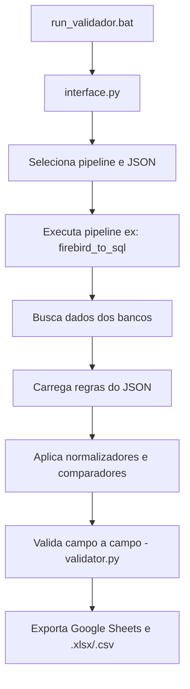

# ✅ Validador de Dados - ERP Director

Ferramenta para **validação automatizada de dados** entre sistemas legados (Firebird, MySQL, SQL Server) e o banco de destino **SQL Server (ERP Director)**.  
Desenvolvida para acelerar a validação de dados durante implantações, com foco em consistência, agilidade e rastreabilidade.

---

## ⚙️ Principais Funcionalidades

- 🔗 Validação entre diferentes tipos de bancos: Firebird, MySQL e SQL Server
- 📄 Regras de validação externas em arquivos `.json`, com suporte a lógica condicional e normalização de dados
- 📊 Comparação dinâmica e linha a linha dos dados (ex: CNPJ, IE, Nome, Data Inativação)
- 📥 Exportação automática para Google Sheets + geração de relatórios locais em `.xlsx` e `.csv`
- 💡 Interface gráfica simples para selecionar pipeline e regras
- 📦 Modular e escalável para múltiplas entidades (clientes, produtos, fornecedores, etc.)

---

## 🧠 Alterações e Melhorias Recentes

- ✅ Ordenação inteligente dos resultados (com base na chave primária e ordem dos campos no JSON)
- ✅ Separação total entre normalização e comparação
- ✅ Aplicação automática de normalizadores definidos nas regras
- ✅ Interface dinâmica para escolha de pipeline + JSON
- ✅ Suporte à geração de regras via planilha

---

## 📁 Estrutura do Projeto

```text
validacao_dados/
│   interface.py
│   main.py
│   run_validador.bat
│   Rodar_regras_json.bat
│   README.md
│   requirements.txt
├── assets/
├── config/
├── core/
│   ├── connectors/
│   ├── pipelines/
│   ├── reports/
│   └── validator.py
├── data/
│   ├── input/
│   └── output/
│       └── jsons/
├── rules/
└── utils/
```

---

## 🔄 Fluxo de Validação



---

## 🧩 Componentes do Projeto

| Componente                          | Função                                                                 |
|------------------------------------|------------------------------------------------------------------------|
| `run_validador.bat`                | Inicia a interface gráfica                                             |
| `interface.py`                     | Interface visual (seleção de pipeline, JSON, log)                     |
| `main.py`                          | Execução via terminal                                                  |
| `core/validator.py`                | Lógica de validação linha a linha                                      |
| `core/pipelines/*.py`              | Pipelines por tipo de origem                                           |
| `core/connectors/*.py`             | Conectores com Firebird, MySQL, SQL Server                            |
| `core/reports/google_sheets.py`    | Exporta para Google Sheets                                             |
| `rules/*.json`                     | Regras de validação externas                                           |
| `data/input/`                      | Templates de planilha para regras                                      |
| `data/output/`                     | Resultados `.csv` e `.xlsx`                                            |
| `utils/gerar_jsons_de_planilha.py`| Gera JSON a partir de planilha Excel                                   |
| `config/`                          | Credenciais e settings                                                 |
| `assets/icone.ico`                 | Ícone para versão `.exe`                                               |

---

## 👣 Como Usar

### 🛠️ 1. Preparar o Ambiente (primeira vez)

```powershell
# Crie a pasta onde quiser
cd "C:\Users\SeuUsuario\Documents\validacao_dados"

# Crie o ambiente virtual
python -m venv .venv

# Ative o ambiente
.venv\Scripts\Activate.ps1

# Caso dê erro de permissão
Set-ExecutionPolicy RemoteSigned -Scope CurrentUser

# Instale as dependências
pip install -r requirements.txt
```

Para desativar o ambiente:
```powershell
deactivate
```

---

### 📄 2. Preparar Regras

- Edite ou crie o JSON em `rules/` ou `data/output/jsons/`
- Use o Excel `template_regras_clientes.xlsx` para montar visualmente
- Execute o script `utils/gerar_jsons_de_planilha.py` para gerar os arquivos

---

### 🚀 3. Executar Validação

#### ✅ Via Interface

1. Clique duplo em `Iniciar_Validador.bat`
2. Escolha pipeline e JSON
3. Clique em **Executar Validação**
4. Veja o log ao vivo na interface

#### ⚙️ Via Terminal

```bash
python main.py firebird_to_sql regras_clientes.json
```

---

### 📊 4. Ver Resultados

- Arquivos `.xlsx` e `.csv` salvos em `data/output/`
- Resultado também enviado para o Google Sheets:  
🔗 [Abrir planilha](https://docs.google.com/spreadsheets/d/16u8KSsLNidNtlZ4daX2Vs-GALqgM7OvESHRpGB9VUI8)

---

### ♻️ 5. Reutilizar

- Para validar outro conjunto de regras, basta trocar o `.json` e executar novamente

---

## 🧬 Exemplo de Regra `.json`

```json
{
  "entidade": "cliente",
  "primary_key": ["DFcod_cliente", "CHAVEPES"],
  "campos": [
    {
      "destino": "DFnome",
      "origem": "NOME",
      "normalizar": "true"
    },
    {
      "destino": "DFcnpj_cpf",
      "origem": ["CNPJ", "CPF"],
      "condicao": {
        "coluna": "TIPOFISCAL",
        "valores": {
          "F": "CPF",
          "J": "CNPJ"
        }
      },
      "normalizar": "documento"
    },
    {
      "destino": "DFinscr_estadual",
      "origem": "IE",
      "normalizar": "true"
    },
    {
      "destino": "DFdata_inativacao",
      "origem": "DATADESATIVADO",
      "normalizar": "true"
    }
  ]
}
```

---

## 🔐 Segurança

- Credenciais estão em `config/credentials.py` e `config/google_credentials.json`
- ⚠️ Nunca suba essas informações para repositórios públicos

---

## 🔧 Expansão e Manutenção

### Adicionar nova entidade

1. Crie um novo `.json` em `rules/`
2. Se necessário, adicione pipeline em `core/pipelines/`
3. Execute pela interface

### Gerar regras por planilha

- Use `utils/gerar_jsons_de_planilha.py`
- Baseie-se no template em `data/input/`

---

## ✅ Observações Finais

- Banco de destino sempre será SQL Server
- Interface exibe logs ao vivo
- Campos divergentes recebem status `Divergente`
- Relatórios incluem totais
- Suporte a múltiplas entidades e novas regras
